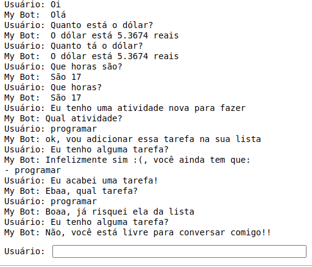

# Chatbot em python
### Rodar: ```pip install chatterbot```
### Exemplo de funcionamento:

### Um post meu sobre isso: https://medium.com/@gumendes.nog.dev/como-criar-um-chatbot-com-python-d121065cc0dc